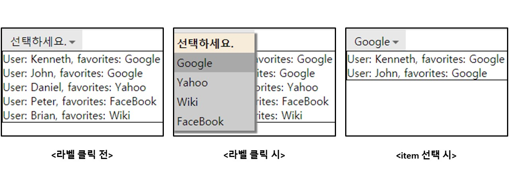

## 케이스 주제

Q. 라벨 클릭 시 선택 가능한 list가 출력되고, dropdown item 선택 시 선택된 데이터의 라벨을 출력해주는 dropdown item을 만드시오.

## 기능 요구사항

1. 라벨 클릭 시 선택 가능한 list가 출력된다.

2. dropdown item을 선택 시 선택된 데이터를 라벨에 출력한다.

3. dropdown item을 선택 시 선택된 데이터를 외부로 전달할 수 있도록 한다.

4. dropdown item을 선택 시 선택된 데이터에 선택 여부를 표시한다.

5. dropdown 외에 영역 클릭 시 아무런 이벤트 없이 리스트를 닫는다.

6. 디자인 템플릿을 변경할 수 있도록 템플릿을 분리한다.

## 기능 작동 이미지

## 실행 방법 / 문제 풀이 방법
1. npm install
Run `npm install`

2. excution
Run `npm run dev`

## 문제
- q1. label position에 dropdown list 영역을 출력하시오.

- q2. backdrop 영역 클릭 시의 이벤트를 처리하시오.

- q3. label 영역 클릭 시의 이벤트를 처리하시오.

- q4. 함수(dispatchEvent)를 참조하여 id, label 값을 인자로 넘겨 이벤트를 발생시키시오.

- q5. 해당 data에서 id에 해당하는 index를 리턴하시오.

## 주요 학습 키워드
- click event target element 설정에 대한 고민
- selector.getBoundingClientRect() 함수
- html element의 data 속성 (selector.dataset)
- arrow function의 활용
- Template literals 을 활용한 html templete 관리